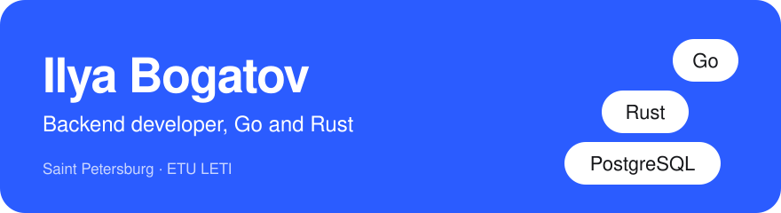
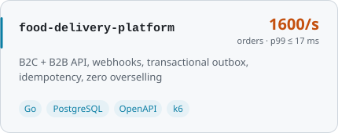
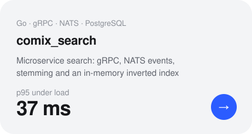
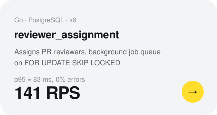
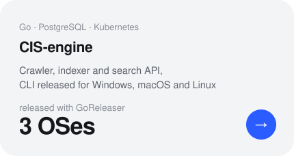
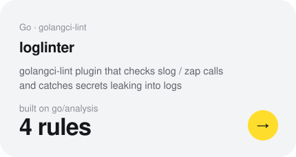
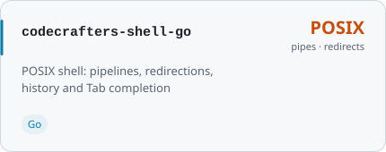

<a href="https://github.com/Cuga77">RU</a> · <b>EN</b>

<picture><source media="(prefers-color-scheme: dark)" srcset="assets/header-dark-en.svg"></picture>

  
  
  

I build services that stay correct under concurrent load, and real-time servers.
Currently working on the authoritative server of a modular real-time simulation platform in **Rust**:
Bevy ECS, versioned network contracts over UDP, Wasm components with transactional rollback.
Master's student at ETU "LETI", Saint Petersburg.

### Featured projects

  <a href="https://github.com/Cuga77/food-delivery-platform"><picture><source media="(prefers-color-scheme: dark)" srcset="assets/food-delivery-platform-dark-en.svg"></picture></a> <a href="https://github.com/Cuga77/comix_search"><picture><source media="(prefers-color-scheme: dark)" srcset="assets/comix_search-dark-en.svg"></picture></a>

  <a href="https://github.com/Cuga77/reviewer_assignment"><picture><source media="(prefers-color-scheme: dark)" srcset="assets/reviewer_assignment-dark-en.svg"></picture></a> <a href="https://github.com/Cuga77/CIS-engine"><picture><source media="(prefers-color-scheme: dark)" srcset="assets/CIS-engine-dark-en.svg"></picture></a>

  <a href="https://github.com/Cuga77/loglinter"><picture><source media="(prefers-color-scheme: dark)" srcset="assets/loglinter-dark-en.svg"></picture></a> <a href="https://github.com/Cuga77/codecrafters-shell-go"><picture><source media="(prefers-color-scheme: dark)" srcset="assets/codecrafters-shell-go-dark-en.svg"></picture></a>

### Stack

  

gRPC · NATS · chi · Gin · pgx · Bevy · Lightyear · Wasmtime · Rapier · k6 · Tracy
