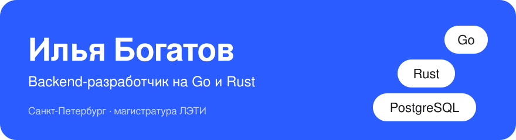
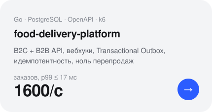
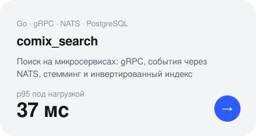
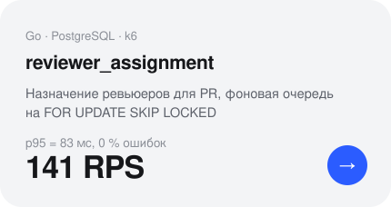
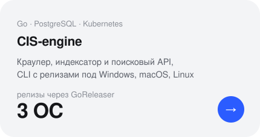
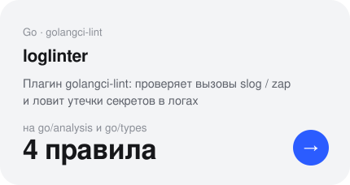
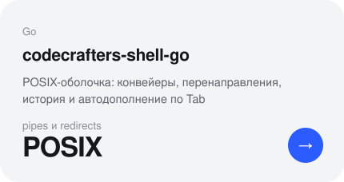

<b>RU</b> · <a href="https://github.com/Cuga77/Cuga77/blob/main/README.en.md">EN</a>

<picture><source media="(prefers-color-scheme: dark)" srcset="assets/header-dark.aea492ae.svg"></picture>

<a href="https://t.me/ibogatov999">Telegram</a> · <a href="mailto:bigatov2021@yandex.ru">bigatov2021@yandex.ru</a>

Пишу сервисы, которые остаются корректными под конкурентной нагрузкой, и серверы реального времени.
Сейчас — авторитетный сервер модульной платформы симуляции на **Rust**: Bevy ECS, сетевые контракты поверх UDP,
Wasm-компоненты с транзакционным откатом.

### Избранные проекты

  <a href="https://github.com/Cuga77/food-delivery-platform"><picture><source media="(prefers-color-scheme: dark)" srcset="assets/food-delivery-platform-dark.aea492ae.svg"></picture></a> <a href="https://github.com/Cuga77/comix_search"><picture><source media="(prefers-color-scheme: dark)" srcset="assets/comix_search-dark.aea492ae.svg"></picture></a>

  <a href="https://github.com/Cuga77/reviewer_assignment"><picture><source media="(prefers-color-scheme: dark)" srcset="assets/reviewer_assignment-dark.aea492ae.svg"></picture></a> <a href="https://github.com/Cuga77/CIS-engine"><picture><source media="(prefers-color-scheme: dark)" srcset="assets/CIS-engine-dark.aea492ae.svg"></picture></a>

  <a href="https://github.com/Cuga77/loglinter"><picture><source media="(prefers-color-scheme: dark)" srcset="assets/loglinter-dark.aea492ae.svg"></picture></a> <a href="https://github.com/Cuga77/codecrafters-shell-go"><picture><source media="(prefers-color-scheme: dark)" srcset="assets/codecrafters-shell-go-dark.aea492ae.svg"></picture></a>

### Стек

**Go** — net/http, chi, Gin, gRPC, pgx, go/analysis 
**Rust** — Bevy (ECS), Lightyear, Wasmtime / WIT, Rapier 
**Данные** — PostgreSQL, NATS, MongoDB 
**Инфраструктура** — Docker, GitHub Actions, GitLab CI, k6, Tracy
